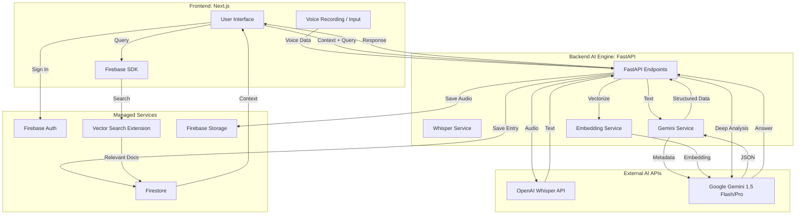

# BrainDump システムアーキテクチャ

## 全体構成図

## コンポーネントの説明

1.  **Next.js (Client)**: ユーザーインターフェースを提供。Firebase SDK を使用して Auth や Firestore と直接通信し、軽量なデータ操作を行う。重いAI処理が必要な時だけ FastAPI を呼び出す。
2.  **FastAPI (AI Engine)**: AI処理のオーケストレーター。Whisper による文字起こしや、Gemini による構造化、Embedding の生成など、Python ライブラリや外部 AI API との連携を専門に行う。
3.  **Firebase**: アプリケーションの状態管理、認証、ファイル保存を担う。
4.  **Firestore Vector Search**: RAG のためのベクトル検索エンジン。エントリ保存時に自動または手動で同期されるベクトルデータに基づき、類似検索を実行する。
